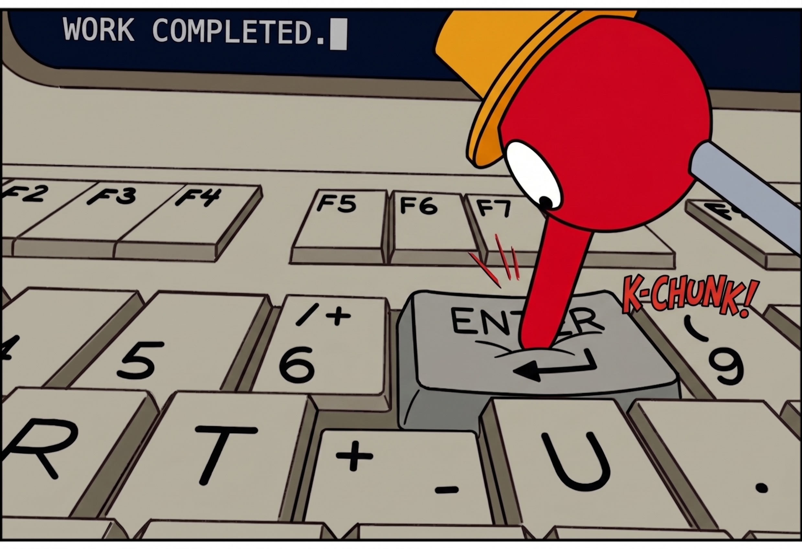

# Claude Code Auto-Accept

A VS Code extension that auto-accepts [Claude Code](https://docs.claude.com/en/docs/claude-code)'s interactive terminal confirmation prompts (`Do you want to proceed?`, `❯ 1. Yes`) so you don't have to babysit long-running sessions.



## How it works

- Uses VS Code's **Terminal Shell Integration API** to watch a terminal's live command output as it streams, rather than blindly spamming Enter on a timer.
- When the output matches Claude Code's confirmation-prompt shape, it sends a single Enter keypress, selecting the default highlighted option (`Yes`).
- Arming is **per terminal** and off by default — nothing is sent unless you explicitly arm a terminal.

## Usage

1. Open a terminal and start `claude`.
2. Click **Auto-Accept: OFF** in the status bar (bottom right) to arm auto-accept for that terminal. It turns into a highlighted **Auto-Accept: ON**.
3. When Claude Code shows a `❯ 1. Yes` / `2. No` style prompt, Enter is sent automatically to accept it.
4. Click the status bar item again (or switch to another terminal and toggle it) to disarm.

You can also run **Claude Code Auto-Accept: Toggle for Active Terminal** from the Command Palette.

## Important: what it actually matches

Detection is intentionally broad — it matches *any* `❯ 1. Yes`-style numbered prompt in the armed terminal's output, not just Claude Code's tool/bash/edit approval gate. That means it will also auto-answer ad-hoc yes/no questions Claude asks you directly in conversation. If you want to be consulted on something specific, disarm the terminal first.

## Limitations

- Requires [VS Code shell integration](https://code.visualstudio.com/docs/terminal/shell-integration) to be active for the terminal's shell (on by default for bash, zsh, fish, and PowerShell). If shell integration never activates for your shell/session, detection won't fire — check the **Claude Code Auto-Accept** output channel (View → Output) for `shell integration became available` / `execution started` log lines to confirm.
- There's no public VS Code API to add a button into the terminal's built-in icon row (next to split/kill/close), so a status bar toggle is the closest equivalent.

## Development

```bash
npm install
npm run compile   # or: npm run watch
```

Press `F5` to launch an Extension Development Host with the extension loaded.

To package a `.vsix`:

```bash
npx @vscode/vsce package
```

## License

MIT
